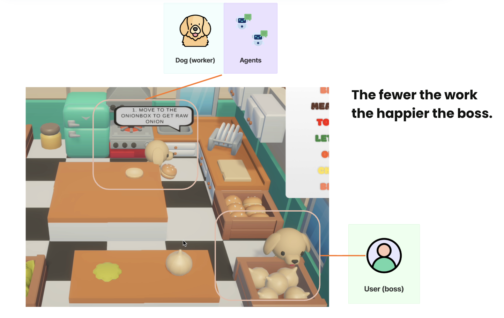
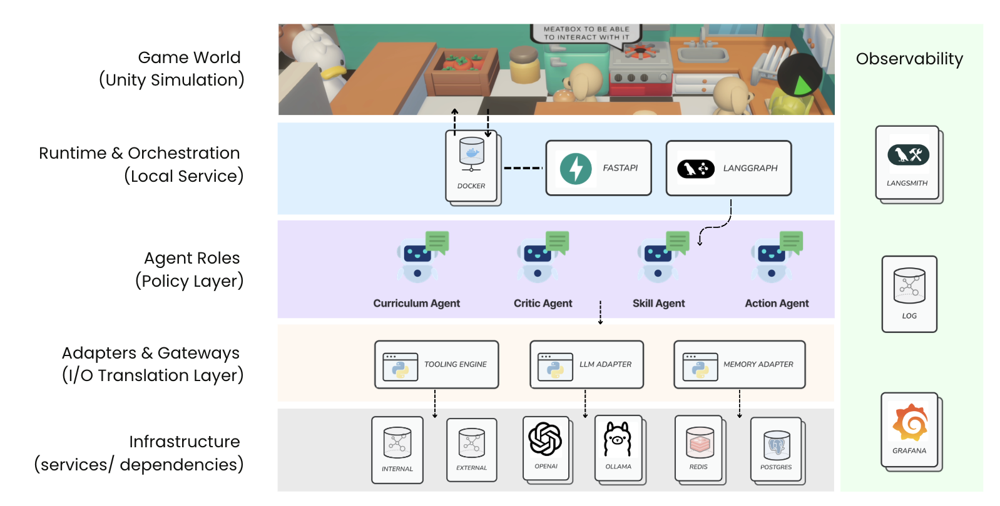
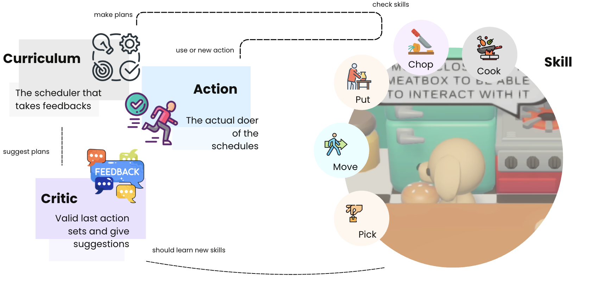
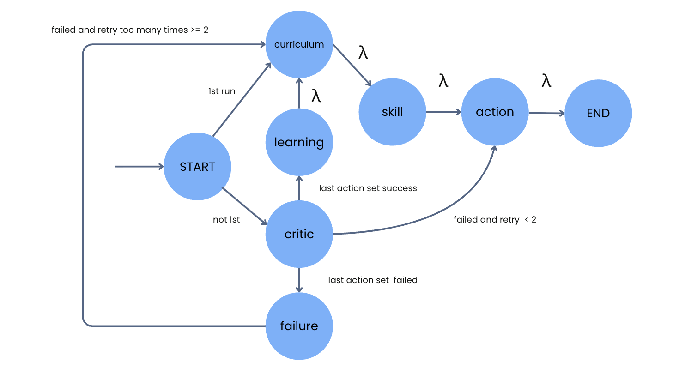

# 🌶️ Paprika: Your Reliable Hamburger Workers


 <br>


<p align="center">
  
</p>

As the industry shifts from chat interfaces to **reliable skill execution**, Paprika addresses the need for agents that can automate complex workflows. Paprika is a framework for embodied cognition that simulates a physical environment using a Unity kitchen. Its architecture decouples the Brain (Python + LangGraph) from the Body (Unity), enabling agents to execute tasks, perceive their environment, and **learn from feedback dynamically**.


## Quickstart

> **Prereqs:** Docker + Docker Compose
> (Optional for local dev: Python 3.11+ and `uv`)

### 1) Configure environment

Create `.env` in the repo root:

```bash
# LLM
OPENAI_API_KEY=...

OLLAMA_BASE_URL=...
OLLAMA_API_KEY=...
OLLAMA_MODEL=gemma3:4b

# LangSmith (optional)
LANGCHAIN_TRACING_V2=true
LANGCHAIN_ENDPOINT=https://api.smith.langchain.com
LANGCHAIN_API_KEY=...
LANGCHAIN_PROJECT=paprika-agent

# OpenWeather (optional tool)
OPENWEATHER_API_KEY=...
OPENWEATHER_BASE_URL=https://api.openweathermap.org
```

### 2) Start services
Start backend first
```bash
docker compose up -d --build
```
Update shcema
```
make migrate
```
or run directly without `make`
```
docker compose exec agent-runtime alembic stamp head 
```

Then click open `Unity` game downloaded in release

### 3) Monitor pgvector (optional)

Paprika stores embeddings in Postgres (`VECTOR(...)`), so the `vector` extension must exist. We can monitor via docker command, or connect to your `grafana`.
```
docker exec -it paprika_db psql -U admin -d paprika_ai
```

## System Architecture
<p align="center">
  
</p>

```text
  Unity (Body)  <------ WebSocket/HTTP ------>  FastAPI (Brain)
  - World state/perception                      - LangGraph graph + session + db
  - Physics + item transforms                   - LLM planner + tool calls 
```

### LLM Roles

<p align="center">
  
</p>

| Role (Module)            | Main responsibility                        | Output format                                 | Key rule / emphasis                          |
| ------------------------ | ------------------------------------------ | --------------------------------------------- | -------------------------------------------- |
| **Curriculur (Planner)** | Chooses the next task                      | **Strict JSON** goal                          | Picks *what to do next*                      |
| **Action (Executor)**    | Executes by selecting tools                | **JSON list** of tool calls + `thought_trace` | Tool-use is explicit and auditable           |
| **Critic (Verifier)**    | Verifies whether the task succeeded        | Verification result based on **world state**  | **No guessing**; only state-based checks     |
| **Skill (SOP Writer)**   | Turns action logs into reusable procedures | Reusable **skills / SOP steps**               | Improves determinism + reliability over time |


## Workflow 
State machine diagram with LangGraph:
<p align="center">
  
</p>

## Extending Paprika
Some features require mirrored changes in **both** Unity (C#) and the backend (Python)—for example, adding new tools or updating shared schemas/contracts.

### 1) Customize the Workflow
The architecture separates Unity (Game Logic) from Python (Decision Making). To integrate your own workflow, follow these steps:
- API & Communication: Update the `schemas` and `routes` files located in `backend/app/api`.
- Agent Logic: Modify the specific agent/ graph files within the `backend/app/agents` directory.
- Best Practice: We recommend using the Adapter Pattern to access the schema. You can implement this by modifying `backend/app/agents/adapter.py`.


### 2) Add a new tool

1. Add a schema in `backend/app/tools/schemas.py`
2. Add a `ToolBuilder` in `backend/app/tools/...` using `@tool_registry.register`
3. Implement the corresponding Unity action handler and ensure IDs match

### 3) Add a new mission

* Update rules (task selection / goal format) under `backend/prompts/template`
* Add Critic win-condition (success definition)
* Optional: add SOP/Skill writer rule if you want reusable skills

## Unity Setup
The backend references Unity GameObjects by exact string ID (passed as args.id). If the ID doesn’t match the scene object name, actions will fail.

### 1) Valid Unity IDs

Containers / Stations (scene object names):
check note in `backend/app/prompts/template/unity_setting`

- Pick ingredient from:
`OnionBox`, `LettuceBox`, `CheeseBox`, `BreadBox`, `TomatoBox`, `MeatBox`

- Interact with the ingredient with:
`Oven`, `CutBoard`, `PlateBoard`, `Trash`

- Put the processed ingredients on:
`Preparation_1`, `Preparation_2`, `Preparation_3`, `Preparation_4`

Keep this list updated whenever you rename/add GameObjects.


### 2) Agent Actions (Tools)

Agents can only interact with the world through a small set of tools. Every tool uses the same argument key: id (unified on purpose to reduce LLM confusion).

#### Supported tools

| Tool       | Purpose                                                           | `args`                  |
| ---------- | ----------------------------------------------------------------- | ----------------------- |
| `move_to`  | Walk to a target object/location                                  | `{ "id": "<UnityID>" }` |
| `pickup`   | Pick up an item (usually from a container / or the item itself)   | `{ "id": "<UnityID>" }` |
| `put_down` | Place the held item onto a surface/station                        | `{ "id": "<UnityID>" }` |
| `chop`     | Chop using a station / chop target (depends on your world design) | `{ "id": "<UnityID>" }` |
| `cook`     | Cook using an appliance/station                                   | `{ "id": "<UnityID>" }` |

#### Action JSON format
The Action Agent must output a JSON list. Each step is a tool call with:
- thought_trace (string)
- function (tool name)
- args with { "id": "..." }

### Example: pick up meat and place on oven

```json
[
  {
    "thought_trace": "Go to MeatBox to grab meat",
    "function": "move_to",
    "args": { "id": "MeatBox" }
  },
  {
    "thought_trace": "Pick up meat",
    "function": "pickup",
    "args": { "id": "MeatBox" }
  },
  {
    "thought_trace": "Walk to the Oven",
    "function": "move_to",
    "args": { "id": "Oven" }
  },
  {
    "thought_trace": "Place meat on Oven to cook",
    "function": "put_down",
    "args": { "id": "Oven" }
  }
]
```

### 3) Perception Contract (recommended)

Avoid relying on “status summary” strings. Use structured fields so the agent can reason about transforms (Raw → Cooked).
Check `perception_send_from_unity_example.txt` under `backend/app/prompts`:
* `self` (held item)
* `sensory` (reachable_objects, visible_objects)
* `statistics` (how many processed ingredient on preparation table)
* `execution_trace` (last actions + results)

<details>

<summary>Why structured perception matters</summary>

State transformations need explicit grounding, otherwise the LLM would not notice, we should provide more memory and log. <br>
eg. If your oven turns `RawMeat` into `CookedMeat`, a string like `held_item: CookedMeat` loses *how it got there*.
Structured fields or an event log (`transformed_from: RawMeat`) prevents “goal confusion”.

</details>


### 4) Missions

Current mission: **Make a Hamburger** (gather → process → assemble).

* Cook meat: `MeatBox → Oven → wait → pickup`
* Chop onion: `OnionBox → CutBoard → chop → pickup`
* Assemble on plate: `Bread + Cheese + prepared ingredients → Plate_agent_X`


## Support & Contact

## License
MIT License
