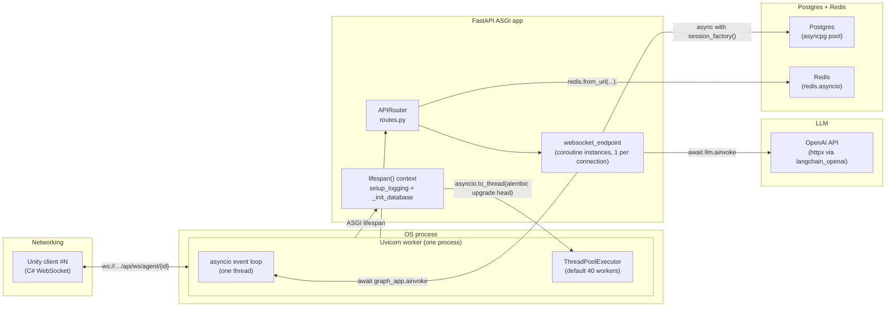
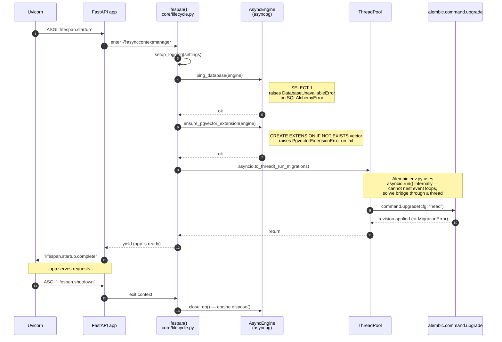
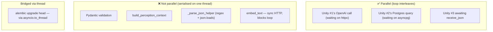

# Diagram: FastAPI + asyncio Under the Hood

This document is *not* a Python tutorial — it is a map of how this specific
backend uses `asyncio`, where event-loop control transfers happen, and which
operations actually run in parallel versus which only *look* like they do.

The big idea: **`async def` is cooperative.** A coroutine holds the single
event-loop thread until it hits an `await` on an awaitable that yields. Every
other coroutine waits its turn. The wins come from the fact that I/O
operations (WebSocket reads, OpenAI calls, Postgres queries) yield to the
loop, so the loop can service other coroutines during those waits.

---

## Layered view: who runs what



**Pieces that matter:**

- **One event loop, one thread.** Uvicorn runs everything async on this single
  loop. CPU-heavy work would block every other coroutine; the codebase avoids
  this by only awaiting I/O.
- **ThreadPoolExecutor** is the escape hatch. `asyncio.to_thread(...)` runs
  sync code on a worker thread so it does not block the loop. Used exactly
  once in this codebase, for Alembic (next section).
- **No multiprocessing.** Horizontal scale is "more Uvicorn workers / pods",
  not subprocesses inside one worker.

---

## Startup: the lifespan hook



The migration call is the *only* sync-bridge in the codebase. The reason it
exists at all: Alembic's `env.py` calls `asyncio.run()` to drive its own async
machinery, and you cannot start a fresh event loop from inside a running one.
`asyncio.to_thread` runs the sync entry on a worker thread, where
`asyncio.run()` can do whatever it wants.

The three failure modes are typed:

```
DatabaseUnavailableError   ← ping_database failed
PgvectorExtensionError     ← CREATE EXTENSION failed
MigrationError             ← Alembic upgrade failed
```

All three are subclasses of `DatabaseError` → `PaprikaError`. See ADR-012.

---

## Per-frame: where a coroutine yields

```mermaid
sequenceDiagram
    autonumber
    participant U as Unity
    participant L as Event loop
    participant H as "websocket_endpoint<br/>(coroutine)"
    participant G as "graph_app.ainvoke<br/>(coroutine)"
    participant LC as "LangChain<br/>ChatOpenAI.ainvoke"
    participant HX as "httpx<br/>(async HTTP)"
    participant SF as "session_factory()<br/>(async ctx mgr)"
    participant AP as asyncpg pool

    Note over H: while True loop;<br/>one iteration per Unity frame

    H->>L: await websocket.receive_json()
    Note right of L: yield — loop runs<br/>other coroutines<br/>until bytes arrive
    U-->>L: WS bytes
    L-->>H: resume; data: dict

    H->>H: Perception(**data) — sync, fast
    H->>H: build_perception_context — sync, fast
    H->>G: await graph_app.ainvoke(state)

    Note over G: LangGraph dispatches<br/>nodes by edges
    G->>LC: await llm.ainvoke(messages)
    LC->>HX: await client.post(openai_url)
    HX->>L: yield — loop free
    Note right of L: other clients' coroutines<br/>can run here
    HX-->>LC: response
    LC-->>G: AIMessage

    G->>SF: async with session_factory() as session:
    SF->>AP: borrow connection from pool
    AP-->>SF: AsyncConnection
    G->>SF: await session.execute(select(...))
    SF->>AP: send query
    AP->>L: yield while waiting on PG
    Note right of L: loop free again
    AP-->>SF: rows
    SF-->>G: result.scalars().all()
    G->>SF: __aexit__ — release connection

    G-->>H: final_state

    H->>L: await websocket.send_json(response)
    L-->>U: WS bytes
    H->>L: loop back to receive_json()
```

### Where coroutines yield (the only places that matter)

| Code | Awaits | Releases the loop? |
|---|---|---|
| `await websocket.receive_json()` | network read | yes (until bytes arrive) |
| `Perception(**data)` | nothing — sync | no |
| `build_perception_context(...)` | nothing — sync | no |
| `await graph_app.ainvoke(...)` | child coroutines | yes (transitively, on each await inside) |
| `await self.llm.ainvoke(messages)` | httpx POST | yes (entire OpenAI call) |
| `async with session_factory() as session` | pool checkout | yes (briefly, when pool is empty) |
| `await session.execute(stmt)` | asyncpg I/O | yes (entire query) |
| `embed_text(text)` (in `PostgresMemoryStore`) | **nothing — sync** | **no** ⚠️ |
| `await websocket.send_json(...)` | network write | yes |

The one watch-out is `embed_text`: it calls
`OpenAIEmbeddings.embed_query(...)` which is **synchronous** in
`langchain_openai`. That call blocks the event loop for the duration of the
HTTP round-trip to OpenAI. With one Unity client it is harmless; with several
clients embedding simultaneously you would see latency spikes for everyone.
Fix when it becomes a problem: wrap in `asyncio.to_thread(embed_text, ...)`
or switch to the async embeddings API.

---

## What runs in parallel, what does not



- **Group A** — the wins from going async. Three Unity clients' I/O waits
  overlap because each `await` releases the loop.
- **Group B** — purely CPU/sync. They are short, so they hide inside the
  natural rhythm of waits. But if any one of them grows (e.g. a more elaborate
  affordance renderer), it directly delays every other coroutine.
- **Group C** — the rescue hatch for sync code that cannot be made async.

---

## Module-level side effects on import

Two import-time facts that surprise people:

1. **`app.core.db.session`** instantiates the AsyncEngine at module top level:

   ```python
   _engine = create_async_engine(settings.DATABASE_URL, …)
   _session_factory = async_sessionmaker(_engine, …)
   ```

   Importing anything from `app.core.db` therefore configures the connection
   pool. Tests rely on `pyproject.toml`'s `[tool.pytest.ini_options].env`
   block to inject dummy DSN values so import does not fail.

2. **`app.agents.graph`** wires the four agents and the tool registry at top
   level:

   ```python
   openai_llm = get_llm("openai", "gpt-4.1-mini")
   session_factory = get_session_factory()
   memory_store = get_memory_store()
   tools = tool_registry.build_all(tool_context)
   curriculum_agent = CurriculumAgent(...)
   skill_agent      = SkillAgent(...)
   action_agent     = ActionAgent(...)
   critic_agent     = CriticAgent(...)
   graph_app        = workflow.compile()
   ```

   So `import app.agents.graph` triggers: LLM client construction,
   `get_llm("openai", ...)` (which currently does NOT call the API but does
   require `OPENAI_API_KEY`), session-factory return, memory-store factory,
   and a full tool registry build. Tests that touch this module set dummy
   keys or mock the openai builder.

These are intentional — production startup wants the wiring eager so the
first WS frame is fast — but they are the reason new contributors sometimes
hit "why does importing this break my test fixture".

---

## Cross-references

- ADR-001 — LangGraph multi-agent orchestration
- ADR-002 — Voyager-style feedback loop
- ADR-003 — Affordance-driven context (the SayCan-style prompt block)
- ADR-004 — WebSocket Unity↔backend transport
- ADR-005 — Why the graph halts at `action_node`
- ADR-006 — LLM provider registry
- ADR-007 — pgvector for episodic + skill memory
- ADR-009 — Tool registry
- ADR-011 — Multi-actor memory schema (proposed)
- ADR-012 — Core module layout
