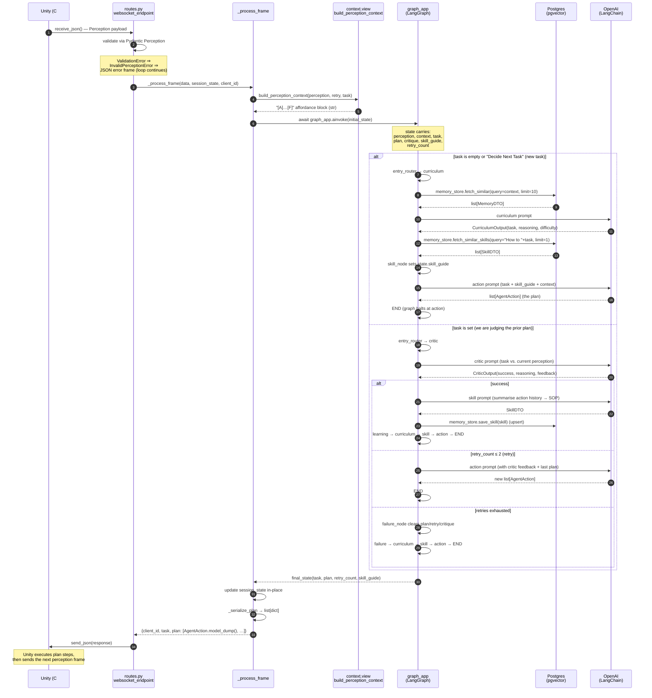
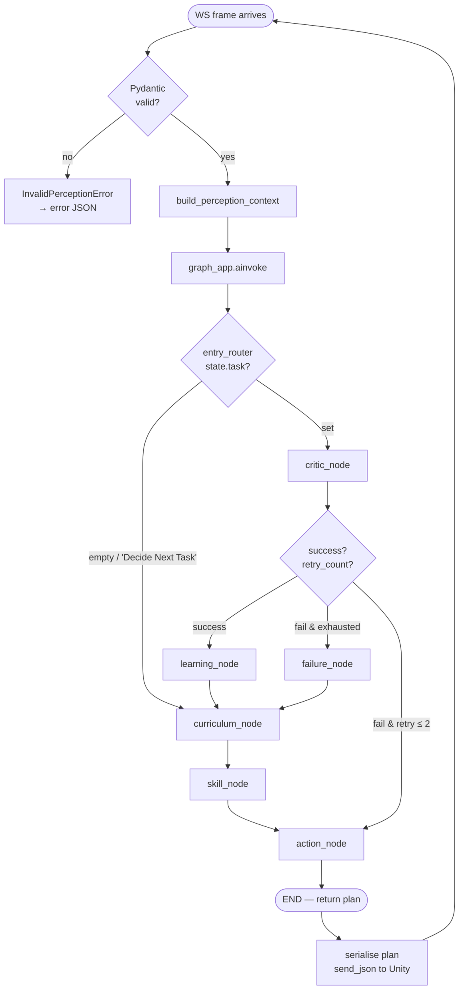

# Diagram: Unity Perception → Backend → Action Round Trip

This is the single end-to-end path one frame takes through the backend. It is
the diagram to read first when learning the codebase.

**Transport:** WebSocket at `ws://host:8000/api/ws/agent/{client_id}`
([app/main.py](../../backend/app/main.py),
[app/api/routes.py:65](../../backend/app/api/routes.py#L65)). One connection
per Unity client; session state is held in-process for the connection's
lifetime.

**Graph entry point:** `entry_router` in
[app/agents/graph.py:149](../../backend/app/agents/graph.py#L149) decides
whether this frame starts a new task (`curriculum`) or evaluates the previous
plan (`critic`).

---

## Sequence (high-level: one Unity frame)



### What each numbered step proves

- **2 — Pydantic validation at the boundary.** Schema drift in Unity is caught
  here, before any agent runs. The handler converts `ValidationError` to
  `InvalidPerceptionError` ([routes.py:130](../../backend/app/api/routes.py#L130))
  so the loop has one error mode to translate, not two.
- **5 — Context built once.** `build_perception_context` runs in the handler
  (not inside an agent node). Every agent reads `state['context']` rather than
  the raw `Perception`. This is the rule that lets Unity's perception shape
  evolve without touching every prompt template — only
  [context/view.py](../../backend/app/context/view.py) needs to change.
- **9 / 18 — LangGraph halts at `action`.** The `END` edge after `action_node`
  is intentional ([graph.py:201](../../backend/app/agents/graph.py#L201)). It
  gives the plan back to Unity, which executes it physically; the next
  perception frame re-enters via `critic` (the entry router sees a non-empty
  `task`). See ADR-005.
- **15 — Skill retrieval is conditional.** It only runs on the
  curriculum-then-action branch. On retry or failure-recovery the agent uses
  the skill_guide already in `session_state` from the previous turn.
- **24 — Session state is mutable across frames.** The dict at
  [routes.py:73](../../backend/app/api/routes.py#L73) is rebound each call
  with the keys the graph cares about. Disconnect = state gone (ADR-004).

---

## The same flow as a control-flow diagram

For readers who prefer the graph view of LangGraph itself:



The arrow that **loops** in this diagram (`Curr → Skill → Action → END → next
frame → Critic → … → Curr`) is the Voyager-style feedback loop (ADR-002). The
arrow that **ends a Python invocation** is `Action → END` — that boundary
exists so Unity can physically execute the plan before the next critic run
(ADR-005).

---

## Concurrency: many Unity clients in parallel

```mermaid
sequenceDiagram
    participant U1 as Unity #1
    participant U2 as Unity #2
    participant L as Uvicorn<br/>event loop
    participant H1 as websocket_endpoint<br/>(coroutine #1)
    participant H2 as websocket_endpoint<br/>(coroutine #2)

    U1->>L: WS upgrade /api/ws/agent/u1
    L->>H1: spawn coroutine, await receive_json()
    U2->>L: WS upgrade /api/ws/agent/u2
    L->>H2: spawn coroutine, await receive_json()

    U1->>L: frame
    L->>H1: resume
    H1->>L: await graph_app.ainvoke(...)
    Note over L: control returns —<br/>loop is free

    U2->>L: frame
    L->>H2: resume
    H2->>L: await graph_app.ainvoke(...)
    Note over L: now BOTH ainvokes<br/>are pending; their<br/>OpenAI/Postgres awaits<br/>interleave on the loop

    L-->>H1: ainvoke resolves
    H1->>U1: send_json(plan)
    L-->>H2: ainvoke resolves
    H2->>U2: send_json(plan)
```

Each WebSocket connection has its own `session_state` dict in the handler
scope ([routes.py:73](../../backend/app/api/routes.py#L73)). The agents
themselves are module-level singletons in
[graph.py:32-50](../../backend/app/agents/graph.py#L32-L50), but they are
stateless from the request side — all per-call data lives in the
`AgentState` TypedDict passed through `ainvoke`. That is what makes parallel
ainvokes safe.

(One caveat: `CurriculumAgent.recent_history` is an in-process list on the
singleton, so today it is shared across all clients. After ADR-011 lands, the
agent factory is keyed by `actor_id` and each actor's history is its own
list.)
